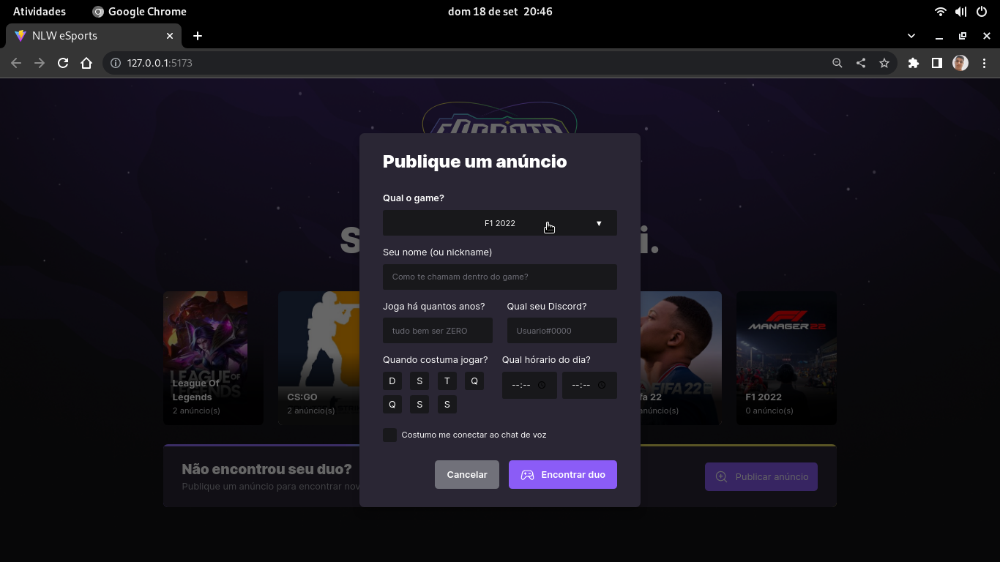

# NLW-eSports Rocketseat

  

  > Trata-se de  uma aplicação onde é possivel buscar duos para games e criar anúncios para um game especifico!

## Técnologias usadas

Front-end:
> Desenvolvido usando: React, TypeScript, Tailwind CSS, phosphor-icons


Back-end:
> Desenvolvido usando: NodeJS, ExpressJS, Prisma, sqlite


Mobile:
> Desenvolvido usando: React Native, Expo, TypeScript, phosphor-react-native


## Instalando Dependências

> Backend
```bash
cd server/ 
npm install
``` 
> Frontend
```bash
cd web/
npm install
``` 
> Mobile
```bash
cd mobile/
npm install
``` 
## Executando aplicação

* Para rodar o back-end:

  ```
  cd server/ && npm start
  ```
* Para rodar o front-end:

  > Para o front-end funcionar corretamente é necessário que o back-end esteja rodando!

  ```
    cd web/ && npm run dev
  ```
* Para rodar o Mobile:

  > Para o mobile funcionar corretamente é necessário que o back-end esteja rodando!

  ```
    cd mobile/ && npm start
  ```

## Executando Testes

* testes ainda em desenvolvimento!
